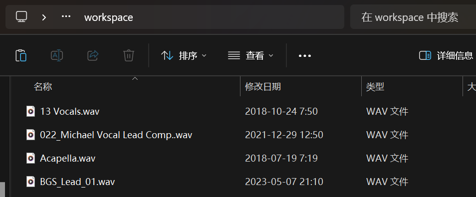
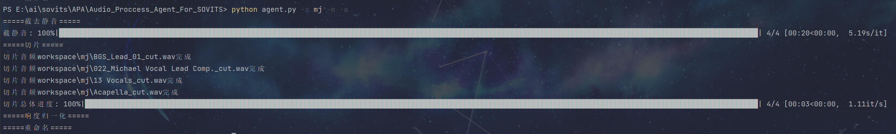
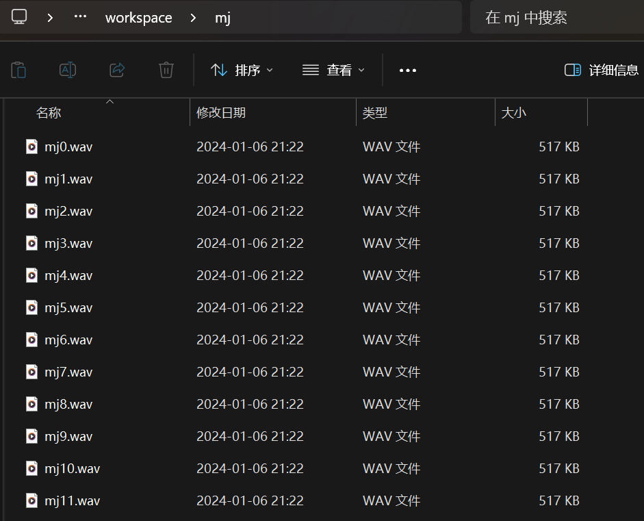

# Audio_Proccess_Agent_For_SOVITS
SOVITS人声数据集预处理脚本合集，将所有音频（支持文件夹嵌套）放入workspace文件夹，开始执行，完成后，在workspace文件夹只剩下名为说话人名字的文件夹，内部是处理好的音频，可以将该文件夹直接拖入SOVITS的dataset_raw文件夹进行训练。

## 参数

| 参数              | 短形式 | 类型   | 默认值                   | 说明                                           |
| ----------------- | ------ | ------ | ------------------------ | ---------------------------------------------- |
| `--input_path`    | `-i`   | 字符串 | `workspace`              | 音频位置，默认处理并覆盖用户文件夹里的所有音频 |
| `--name`          | `-n`   | 字符串 | 无                       | 说话人名字，此参数为必须指定                   |
| `--format_input`  | `-fi`  | 列表   | `['wav', 'flac', 'mp3']` | 支持处理的文件后缀，处理后统一为wav格式        |
| `--multi_process` | `-m`   | 布尔   | `False`                  | 是否启用并行处理，建议开启以提升处理速度       |
| `--auto`          | `-a`   | 布尔   | `False`                  | 是否按顺序自动全流程处理                       |

**第一步：截去静音**

| 参数                | 短形式     | 类型 | 默认值  | 说明                                    |
| ------------------- | ---------- | ---- | ------- | --------------------------------------- |
| `--cut_silence`     | `-c`       | 布尔 | `False` | 是否剪去静音部分                        |
| `--thresh`          | `-thr`     | 整数 | `-50`   | 认为是静音的阈值                        |
| `--min_silence_len` | `-len`     | 整数 | `300`   | 认为是静音的最小长度，默认300毫秒       |
| `--padding`         | `-padding` | 整数 | `100`   | 保留在切割点前后的静音长度，默认100毫秒 |

**第二步：音频切片**

| 参数             | 短形式 | 类型   | 默认值  | 说明                         |
| ---------------- | ------ | ------ | ------- | ---------------------------- |
| `--split`        | `-s`   | 布尔   | `False` | 是否进行音频切片             |
| `--split_second` | `-sec` | 浮点数 | `3`     | 切片长度，默认3秒，建议3-5秒 |

**第三步：响度归一化**

| 参数            | 短形式  | 类型   | 默认值  | 说明                                           |
| --------------- | ------- | ------ | ------- | ---------------------------------------------- |
| `--normalize`   | `-norm` | 布尔   | `False` | 是否进行响度归一化                             |
| `--target_dbfs` | `-dbfs` | 浮点数 | `-14`   | 归一化的目标响度，默认-14dBFS，更保守可以为-16 |

**第四步：重命名**

| 参数       | 短形式 | 类型 | 默认值  | 说明                     |
| ---------- | ------ | ---- | ------- | ------------------------ |
| `--rename` | `-rn`  | 布尔 | `False` | 是否进行批量格式化重命名 |


## 示例

**将MJ一些歌曲的人声音轨放入workspace：**




**执行全流程脚本：（-m 开启并行处理）**

```shell
python agent.py -n mj -m -a
```




**完成后得到格式整齐的干声数据集：**


